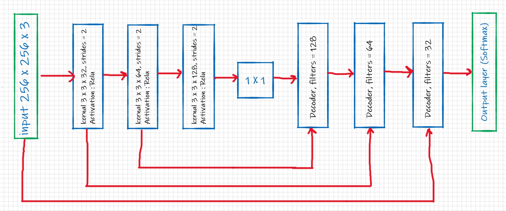
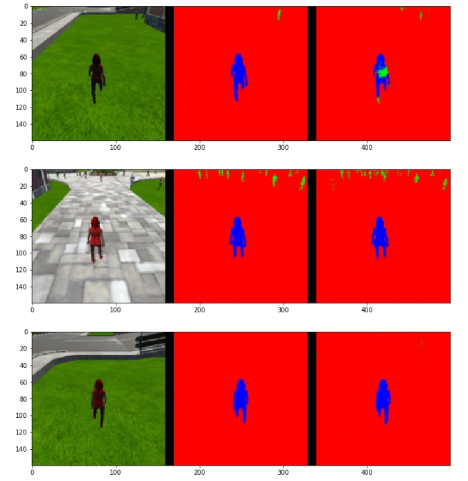
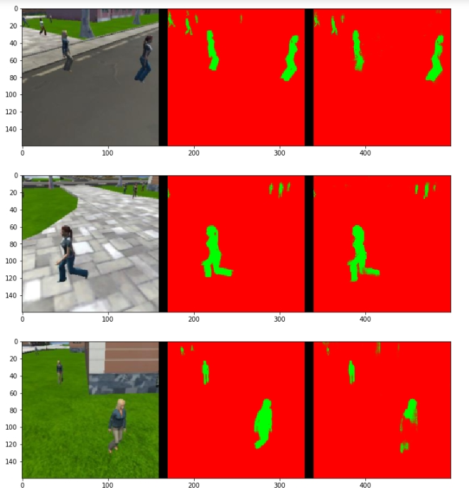
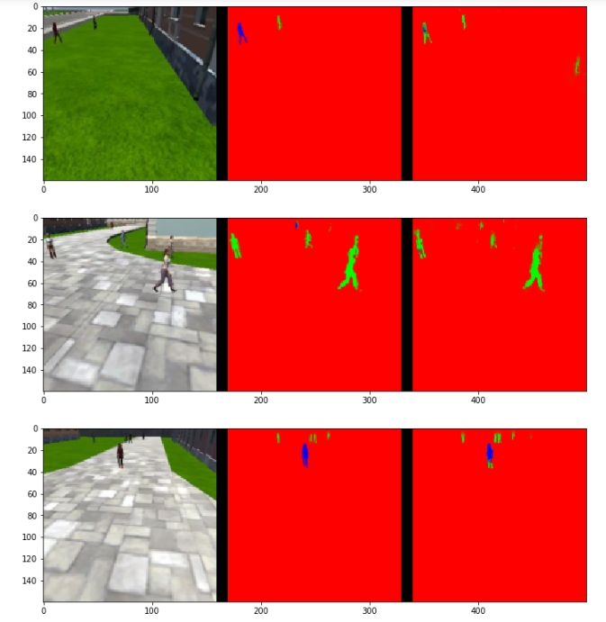

[](https://www.udacity.com/robotics)

## Deep Learning Project ##

# content 
1. Project overview.
2. Setting up the environment.
3. Collecting Data.
4. FCN Components.
5. Network Architecture
6. Model Building
7. Model Training.
8. Model Prediction.
9. Model Evaluation.
10. Different Object Detections.

# 1 - Project overview

In this project, we will train a deep neural network to identify and track a target in simulation.

[image_0]: ./docs/misc/sim_screenshot.png
![alt text][image_0] 


# 2 - Setting up the environment

**Clone the repository**
```
$ git clone https://github.com/udacity/RoboND-DeepLearning.git
```

**Download the data**

Save the following three files into the data folder of the cloned repository. 

[Training Data](https://s3-us-west-1.amazonaws.com/udacity-robotics/Deep+Learning+Data/Lab/train.zip) 

[Validation Data](https://s3-us-west-1.amazonaws.com/udacity-robotics/Deep+Learning+Data/Lab/validation.zip)

[Sample Evaluation Data](https://s3-us-west-1.amazonaws.com/udacity-robotics/Deep+Learning+Data/Project/sample_evaluation_data.zip)

**Download the QuadSim binary**

To interface your neural net with the QuadSim simulator, you must use a version QuadSim that has been custom tailored for this project. The previous version that you might have used for the Controls lab will not work.

The simulator binary can be downloaded [here](https://github.com/udacity/RoboND-DeepLearning/releases/latest)

**Install Dependencies**

You'll need Python 3 and Jupyter Notebooks installed to do this project.  The best way to get setup with these if you are not already is to use Anaconda following along with the [RoboND-Python-Starterkit](https://github.com/udacity/RoboND-Python-StarterKit).

If for some reason you choose not to use Anaconda, you must install the following frameworks and packages on your system:
* Python 3.x
* Tensorflow 1.2.1
* NumPy 1.11
* SciPy 0.17.0
* eventlet 
* Flask
* h5py
* PIL
* python-socketio
* scikit-image
* transforms3d
* PyQt4/Pyqt5

# 3 - Collecting Data

In our work on this project we didn't need additional data for training the network to meet the reqired specifications. So, we only used the given data for training and validation.

# 4 - FCN Components

Fully Convolutional Networks is used for semantic segmentaion of the scene to detect required objects and their locations. 
This is different to the classical convolution networks which composed only of convolutional layers (encoders) and are capable of 
classification tasks. The FCN is basically a concatination of consequent stages: 
#### Encoder 
Encoder is the convolutional layer in the FCN. You Apply the kxk kernel to map the input image to a deeper output enabling the extraction
of more information from the image. The output of an encoder may be passed as an input to a deeper convolutional layer for more information 
extraction. 
#### Fully Connected Layer 
Fully Connected Layer is a classical NN layer where all input neurons are connected to output neurons resulting in a large number of weights
refered to as "dense" layer. In this project we didn't use fully connected layer since it doesn't give spatial information of the pixels
which is required in object tracking (It is suitable in classification tasks).
#### 1x1 convolution  
1x1 convolution is applied to the output of a convolution layer. The aim of 1x1 convolution is encoding spatial information and (may be) reducing dimensionality of a layer. 
By definition, compared to fully connected layer, 1x1 convolution added advantage of working with different input sizes during prediction. 
In this project we add a 1x1 convolution layer after encoder layers.    
#### Decoder  
Decoder is the transposed convolution layer in the FCN. It is rseponsible for upsampling the previous layer to desire resolution. 
The Decoder is an important part that make difference detween FCN and classical CNN as it enbale determination of the position of the object to
be detected in the image. Decoder layer may take data from previous layer to upsample it or take data from input layer with the same resolution of the decoder output. 
This process is called skip connections and enables passing certain information from input to the output stage. We use both upsampling and skip connection operartions
in each decoder of the network.

# 5 - Network Architecture
In this project we adobt the architecture shown below. This architecture is the one gave us required accuracy.



# 6 - Model Building

As shown above, our model consists of 3 successive encoder layers, followed by a 1X1 convolution layer. Then, 3 decoders for upsampling (including concatination for skip connections from previous layer). Finally, a softmax function is applied to get the output in the desired dimension
#### Encoder code 
```
def encoder_block(input_layer, filters, strides):
    
    # TODO Create a separable convolution layer using the separable_conv2d_batchnorm() function.
    output_layer = separable_conv2d_batchnorm(input_layer, filters, strides)
    return output_layer
```
#### Decoder code 
```
def decoder_block(small_ip_layer, large_ip_layer, filters):
    
    # TODO Upsample the small input layer using the bilinear_upsample() function.
    x = bilinear_upsample(small_ip_layer)
    # TODO Concatenate the upsampled and large input layers using layers.concatenate
    x = layers.concatenate([x,large_ip_layer])
    # TODO Add some number of separable convolution layers
    output_layer = separable_conv2d_batchnorm(x, filters)
    return output_layer
```
#### The whole model    
```
def fcn_model(inputs, num_classes):
    
    # TODO Add Encoder Blocks. 
    # Remember that with each encoder layer, the depth of your model (the number of filters) increases.
    encoder_1 = encoder_block(inputs,32,2)
    encoder_2 = encoder_block(encoder_1,64,2)
    encoder_3 = encoder_block(encoder_2,128,2)
    # TODO Add 1x1 Convolution layer using conv2d_batchnorm().
    bottelneck = conv2d_batchnorm(encoder_3, 128, kernel_size=1, strides=1)
    # TODO: Add the same number of Decoder Blocks as the number of Encoder Blocks
    decoder_1 = decoder_block(bottelneck, encoder_2, 128)
    decoder_2 = decoder_block(decoder_1, encoder_1, 64)
    decoder_3 = decoder_block(decoder_2, inputs, 32)
    # The function returns the output layer of your model. "x" is the final layer obtained from the last decoder_block()
    return layers.Conv2D(num_classes, 1, activation='softmax', padding='same')(decoder_3)
```
# 7 - Model Training
We used Hyperparameters values as shown below to get loss: 0.0179 - val_loss: 0.0267

```
learning_rate = 0.001
batch_size = 64
num_epochs = 20
steps_per_epoch = 200
validation_steps = 50
```

# 8 - Model Prediction
The weights of the trained model are saved in model_weights.h5 file. When we use this model for prediction, it is tested for three cases: following the target, patrol without target, and patrol with target. The code for testing the three cases is found below with images showing the success of each case.

#### Follwing the target
```
# images while following the target
im_files = plotting_tools.get_im_file_sample('sample_evaluation_data','following_images', run_num) 
for i in range(3):
    im_tuple = plotting_tools.load_images(im_files[i])
    plotting_tools.show_images(im_tuple)
```



#### Patrol without target
```
# images while at patrol without target
im_files = plotting_tools.get_im_file_sample('sample_evaluation_data','patrol_non_targ', run_num) 
for i in range(3):
    im_tuple = plotting_tools.load_images(im_files[i])
    plotting_tools.show_images(im_tuple)
```



#### patrol with target
```
# images while at patrol with target
im_files = plotting_tools.get_im_file_sample('sample_evaluation_data','patrol_with_targ', run_num) 
for i in range(3):
    im_tuple = plotting_tools.load_images(im_files[i])
    plotting_tools.show_images(im_tuple)
```


# 9 - Model Evaluation
#### According to the prediction step using our trained model we can calculate scores of different tests.

Scores for while following the target:
```
number of validation samples intersection over the union evaulated on 542
average intersection over union for background is 0.9958020155713594
average intersection over union for other people is 0.3711230795629894
average intersection over union for the hero is 0.9000406846797073
number true positives: 539, number false positives: 0, number false negatives: 0
```

Scores for while patroling whithout target in the scene:
```
number of validation samples intersection over the union evaulated on 270
average intersection over union for background is 0.9864909043270813
average intersection over union for other people is 0.7266679174217763
average intersection over union for the hero is 0.0
number true positives: 0, number false positives: 63, number false negatives: 0
```

Scores for while patroling with target in the scene:

```
number of validation samples intersection over the union evaulated on 322
average intersection over union for background is 0.9965876286304663
average intersection over union for other people is 0.45313874373418683
average intersection over union for the hero is 0.2297104701290615
number true positives: 139, number false positives: 4, number false negatives: 162
```

The Final evaluation is calculated using IOU (Intersection Over Union) which is the ratio between two components: (pixels that are a part of a class AND classified as a part of that class i.e true positive) and (pixels that are part of a class OR pixels that classified to be part of that class i.e true poisive + false positive).

##### Total score 
Sum all the true positives, etc from the three datasets to get a weight for the score 
```
weight = true_pos/(true_pos+false_neg+false_pos)

weight = 0.7475192943770672
```
The IOU is the average between IOU1 and IOU3 (i.e. execlude testcases where there is no target in the scene) 
```
final_IoU = 0.564875577404
```
Then the final grade score calculated as: final_score = final_IoU * weight
```
final_score = 0.422255393032
```
This score meet the required specs (>0.4)
